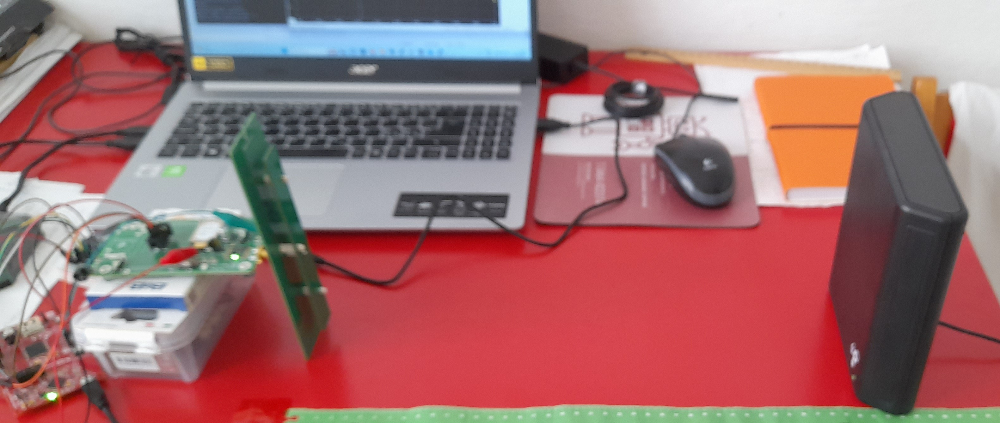
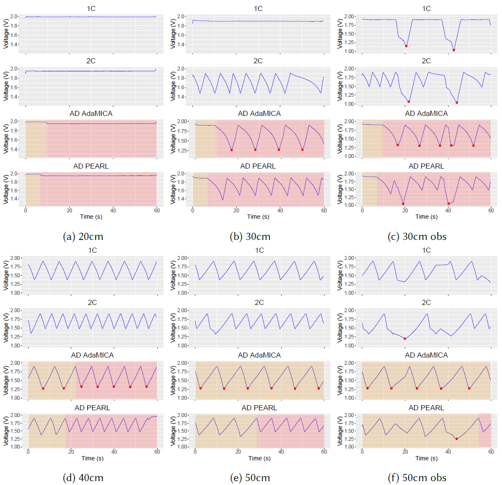

# MACOP execution on MAX32666

## Introduction

The project is to compile and run the MACOP execution experiments on the MAX32666 dual-core planform. The execution adapts to the strength of ambient power.

## Dependencies

- [MAX SDK (2022)](https://analogdevicesinc.github.io/msdk/USERGUIDE/)
- [MAX32666FTHR Evaluation Kit](https://www.analog.com/en/resources/evaluation-hardware-and-software/evaluation-boards-kits/max32666fthr.html#eb-overview)

## Content of the Project

```
.
├── includes
	├── pearllib.h  : Pearl library header
├── README.md       : This file
├── .settings       : Eclips settings
├── .vscode         : VSCode settings
├── config.h        : Configuration file
├── pearllib.c      : Pearl library functions
├── main.c          : Main application file
```

The main application file is divided into three blocks: ```DUAL_CORE_EXPERIMENT, SINGLE_CORE_EXPERIMENT, ADAPTIVE_EXPERIMENT```
The last one uses the Pearl library macros. By default in MAX32666, all the computations happening in ```main()``` belong to ```Core0```, while the computations code for ```Core1``` is given in ```main_core1()```. 

## How to run?

```
- Import the project to the MAX SDK
- Connect the evaluation kit
- Compile and run
```

## Output

MACOP and Power failure count in single- and dual-core modes separately.

## Capacitor Voltage Tracking in the Real Experimental Setup

### Hardware Setup
During the execution of the MAC operations on MAX32666, we track the voltage of the capacitor, locating the power source at different distances from the energy harvester, as shown in the figure below. 




### Results


For the AD AdaMICA and AD PEARL modes, the yellow and red fractions are executed in the 1C and 2C modes, respectively. Red dots denote power failures. Positioning the RF transmitter 20cm away from the receiver does not make any changes in performance compared to the constantly powered environment because the harvested power is strong enough to maintain uninterrupted computation for both 1C and 2C modes. Increasing the distance between the RF transmitter and receiver to 30cm reduces the amount of harvested energy, which causes the interrupts in the 2C execution but keeps the 1C performance unintermittent. The AD modes in this scenario perfectly adjust the architecture to input power. However, compared to AdaMICA, PEARL encounters no power failures, which increases the performance by 15%. The 40cm and 50cm distances significantly reduce MACOPS for all the modes, making the 2C mode outperform the 1C mode only by 70% and 61%, respectively. Increasing the distance also increases the number of power failures in AdaMICA, allowing PEARL to perform 1.3× better. Distracting the RF energy transmission by obstacles during the application execution causes power failures also in PEARL. The power failures in the 30cm distance reduce the difference between 1C MACOPS and 2C MACOPS from 95% to 70%, but the adaptive mode in this case outperforms the 1C solution by circa 83%. The power failure in the 50cm distance for the 2C mode prevents this mode from outperforming the 1C mode. However, for AD PEARL, a power failure happens during the 1C execution, which is then compensated by the 6 sec of the 2C execution.
