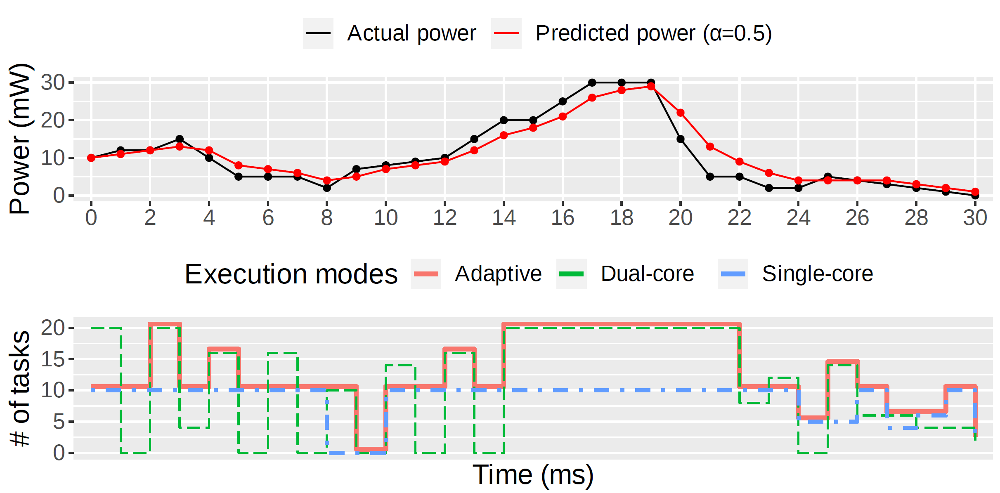

### High-level Simulation Results

PEARL power-aware scaling algorithm switches to the most performant multi-core execution mode considering the predicted average ambient energy, as shown in the figure below.

