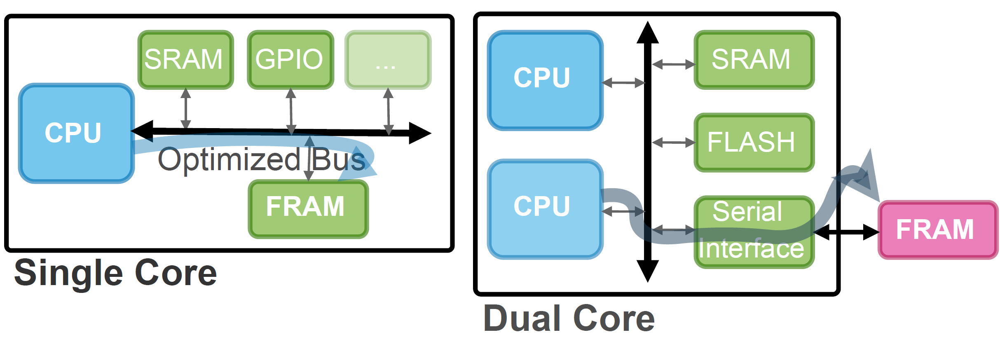

##  [EWSN 2025] PEARL: Power- and Energy-Aware Multicore Intermittent Computing

### Introduction

This repository contains the Python simulation results and MACOP executon code on the MAX32666 platform. The extended results were presented in the paper titled PEARL: Power- and Energy-Aware Multicore Intermittent Computing and presented in THE 22ND INTERNATIONAL CONFERENCE ON EMBEDDED WIRELESS SYSTEMS AND NETWORKS in Leuven, Belgium. PEARL is a novel systems support that can make existing multicore microcontroller (MCU) platforms suitable for efficient intermittent computing. PEARL achieves this by leveraging only a three-threshold voltage tracking circuit and an external fast non-volatile memory, which multicore MCUs can smoothly interface.

Single-core microcontrollers for intermittent computing (e.g., TI MSP430FR series) include an internal FRAM integrated into their architecture. Existing ultra-low-power dual-core MCUs can only be used for intermittent computing by connecting an external FRAM memory, introducing energy and latency overhead.

The MCU market is expanding and providing many low-power computing platforms to support AI on resource-limited edge devices. As an example, MAX32666 [28] from Maxim Integrated has dual Arm Cortex-M4F processors with 1MB Flash and 560KB SRAM. The right-hand side of the figure below presents the high-level architectural overview of MAX32666. The two ARM Cortex processors can use the optimized interconnecting bus to access the SRAM, FLASH, and peripherals. The computational power and parallelism support of MAX32666 comes with power efficiency. In active mode, it consumes approximately 3mA at 96MHz. Moreover, in deep sleep mode, it only consumes 10 µA. Therefore, MAX32666 can also be a suitable candidate for modern battery-free AI applications.
However, exploiting multicore architectures for intermittent computing poses several challenges.



PEARL addresses the drawbacks of the state of the art, enabling efficient intermittent computing on a significantly broader range of existing embedded systems. In particular, PEARL brings the concept of power- and energy-aware multicore intermittent computing to the table. PEARL’s HML circuitry brings energy awareness to multicore platforms by triggering interrupts regarding the voltage level of the energy storage.

### High-level Simulation Results

PEARL power-aware scaling algorithm switches to the most performant multi-core execution mode considering the predicted average ambient energy, as shown in the figure below.


### Capacitor Voltage Tracking in the Real-hardware Experimental Setup

During the execution of the MAC operations on MAX32666, we track the voltage of the capacitor, as shown in the figure below. For the AD AdaMICA and AD PEARL modes, the yellow and red fractions are executed in the 1C and 2C modes, respectively. Red dots denote power failures.


Positioning the RF transmitter 20cm away from the receiver does not make any changes in performance compared to the constantly powered environment because the harvested power is strong enough to maintain uninterrupted computation for both 1C and 2C modes. Increasing the distance between the RF transmitter and receiver to 30cm reduces the amount of harvested energy, which causes the interrupts in the 2C execution but keeps the 1C performance unintermittent. The AD modes in this scenario perfectly adjust the architecture to input power. However, compared to AdaMICA, PEARL encounters no power failures, which increases the performance by 15%. The 40cm and 50cm distances significantly reduce MACOPS for all the modes, making the 2C mode outperform the 1C mode only by 70% and 61%, respectively. Increasing the distance also increases the number of power failures in AdaMICA, allowing PEARL to perform 1.3× better. Distracting the RF energy transmission by obstacles during the application execution causes power failures also in PEARL. The power failures in the 30cm distance reduce the difference between 1C MACOPS and 2C MACOPS from 95% to 70%, but the adaptive mode in this case outperforms the 1C solution by circa 83%. The power failure in the 50cm distance for the 2C mode prevents this mode from outperforming the 1C mode. However, for AD PEARL, a power failure happens during the 1C execution, which is then compensated by the 6 sec of the 2C execution.

Please find more details in the article.

### Citation (BibTeX)

```
will come soon ...
```